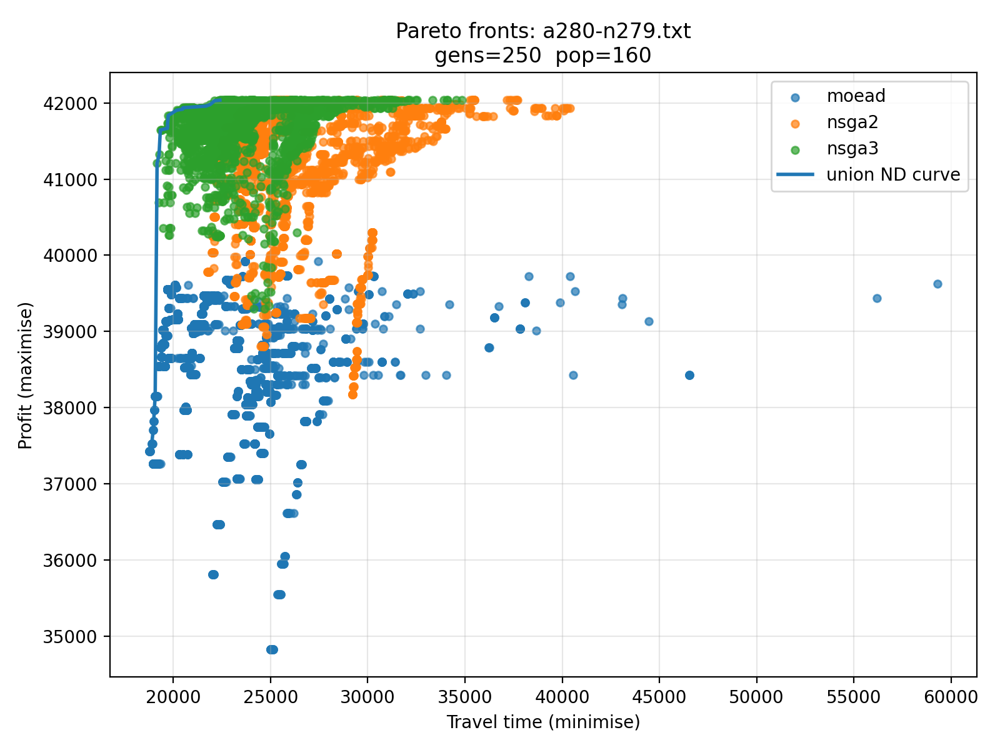

## Travelling Thief Problem — Evolutionary Optimisation with pymoo

The Travelling Thief Problem (TTP) is a combinatorial optimisation benchmark that combines two classic NP-hard problems: the Travelling Salesman Problem (TSP) and the 0/1 Knapsack Problem. The thief must visit all cities in a tour, picking up items along the way — but collected items add weight, which slows the thief down and increases travel time. This coupling creates a conflict between maximising profit and minimising travel time, making TTP a rich multi-objective challenge.

This project implements both single-objective and multi-objective solvers for TTP using the [pymoo](https://pymoo.org/) framework, evaluated on two standard benchmark instances.

---

##  Project Overview

Two complementary approaches are used to solve TTP:

- **Single-objective** — the two objectives are scalarised into a weighted sum, allowing exploration of the profit/time trade-off across a range of weight configurations.
- **Multi-objective** — the Pareto front is approximated directly, revealing the full set of optimal trade-offs between profit and travel time.

---

##  Algorithms Implemented

**Single-objective:**

| Algorithm | Description |
|---|---|
| **GA** | Genetic Algorithm with SBX crossover and polynomial mutation |
| **DE** | Differential Evolution with DE/rand/1/bin variant |

**Multi-objective:**

| Algorithm | Description |
|---|---|
| **NSGA-II** | Non-dominated Sorting Genetic Algorithm II |
| **NSGA-III** | Reference point-based many-objective extension of NSGA-II |
| **MOEA/D** | Decomposition-based algorithm using weighted reference directions |

---

##  Datasets

| Instance | Cities | Items |
|---|---|---|
| a280-n279 | 280 | 279 |
| fnl4461-n4460 | 4461 | 4460 |

Both datasets are standard TTP benchmarks and are included in the `data/` directory.

---

##  Project Structure

```
travelling-thief-problem-pymoo/
├── src/
│   ├── ttp_io.py          # Parses TTP instance files into a dataclass
│   ├── ttp_model.py       # Tour time, profit, and objective computation
│   ├── ttp_pymoo.py       # pymoo Problem subclasses and algorithm runners
│   ├── run_single.py      # CLI for single-objective runs (GA / DE)
│   ├── run_multi.py       # CLI for multi-objective runs (NSGA-II/III, MOEA/D)
│   ├── plotting.py        # Pareto front visualisation
│   ├── plot_weights.py    # Weight sensitivity plots for single-objective runs
│   └── ttp_eval.py        # Hypervolume and spacing evaluation metrics
├── data/
│   ├── a280-n279.txt
│   └── fnl4461-n4460.txt
├── results/               # Output plots
└── README.md
```

---

##  Performance Metrics Tracked

Each multi-objective run is evaluated using:

- **Hypervolume** — area dominated by the approximated Pareto front (raw and normalised)
- **Spacing** — uniformity of solution distribution along the front
- **Time and profit ranges** — spread of objective values across the front

---

##  Tech Stack

- **Python 3**
- **Libraries:** pymoo, NumPy, pandas, matplotlib, scipy

---

##  How to Run

1. Clone the repository:
   ```bash
   git clone https://github.com/ananthananthananth/travelling-thief-problem-pymoo.git
   ```

2. Install dependencies:
   ```bash
   pip install pymoo numpy pandas matplotlib scipy
   ```

3. Run single-objective study:
   ```bash
   python -m src.run_single --inst data/a280-n279.txt --gens 200 --pop 120 \
     --seeds 1 2 3 4 5 --algo both --prefix a280_
   ```

4. Plot weight sensitivity:
   ```bash
   python -m src.plot_weights --csv results/a280_results_single_ga.csv \
     --out_prefix results/a280_ga_weights --mode mean
   ```

5. Run multi-objective study:
   ```bash
   python -m src.run_multi --inst data/a280-n279.txt --gens 250 --pop 160 \
     --seeds 1 2 3 4 5 --prefix a280_
   ```

6. Plot Pareto fronts:
   ```bash
   python -m src.plotting --combined results/a280_fronts_combined_all_seeds.csv \
     --out_png results/a280_pareto_fronts.png
   ```

7. Evaluate hypervolume and spacing:
   ```bash
   python -m src.ttp_eval --combined results/a280_fronts_combined_all_seeds.csv \
     --out results/a280_eval
   ```

---

##  Results

### Single-Objective (GA vs DE)

Each algorithm was run across 20 independent seeds on a280 and 10 on fnl4461, sweeping across 5 weight configurations from pure profit to pure time minimisation.

**a280 instance:**

| Algorithm | Best Fitness | Mean Fitness | Median Fitness | Std Dev | Runtime (s) |
|---|---|---|---|---|---|
| GA | -0.563 | -0.835 | -0.818 | 0.134 | 37,474 |
| DE | -0.323 | -0.581 | -0.517 | 0.197 | 56,483 |

**fnl4461 instance:**

| Algorithm | Best Fitness | Mean Fitness | Median Fitness | Std Dev | Runtime (s) |
|---|---|---|---|---|---|
| GA | -2.382 | -3.864 | -3.736 | 1.012 | 14,384,870 |
| DE | -0.598 | -1.319 | -1.162 | 0.519 | 18,602,266 |

On the smaller a280 instance, GA and DE were broadly competitive — GA was faster and more consistent, while DE produced stronger best and median solutions. On the large fnl4461 instance the gap widened considerably: DE outperformed GA across all metrics with lower variance, while GA struggled to maintain solution quality and consistency at scale.

---

### Multi-Objective (NSGA-II vs NSGA-III vs MOEA/D)

**a280 instance** (20 seeds, 250 generations, population 160):

| Algorithm | Hypervolume | Spacing | Runtime (s) |
|---|---|---|---|
| NSGA-II | 2.02 × 10⁸ | 37.29 | 6,448 |
| NSGA-III | 2.18 × 10⁸ | 54.61 | 4,857 |
| MOEA/D | 1.10 × 10⁸ | 687.26 | 14,591 |

**fnl4461 instance** (10 seeds, 200 generations, population 200):

| Algorithm | Hypervolume | Spacing | Runtime (s) |
|---|---|---|---|
| NSGA-II | 2.82 × 10¹¹ | 9,560.11 | 1,934,126 |
| NSGA-III | 3.31 × 10¹¹ | 5,548.33 | 1,184,312 |
| MOEA/D | 0.00 | 302,369.22 | 5,026,319 |

On a280, NSGA-II delivered the best balance of convergence and diversity (lowest Spacing), while NSGA-III achieved the highest Hypervolume. MOEA/D underperformed on both metrics. On fnl4461, NSGA-III showed surprisingly strong performance — achieving the highest Hypervolume and lowest Spacing despite being designed for many-objective problems. MOEA/D failed to scale, producing a Hypervolume of zero and collapsing in diversity entirely.



---

##  Notes

- Solutions are decoded from a continuous representation: the first `n_cities` values encode tour order via argsort, the remaining `n_items` values encode item selection as a binary threshold at 0.5.
- A greedy repair heuristic enforces knapsack capacity by dropping items in ascending profit-to-weight ratio order.
- The distance matrix for the large fnl4461 instance is computed using a pure Python loop, which is slow but correct. This is a known limitation for very large instances.
